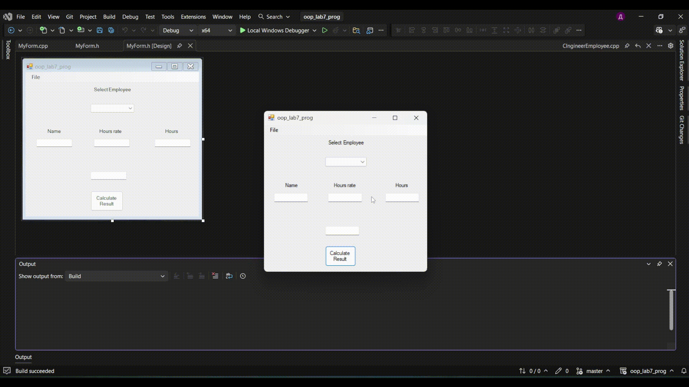
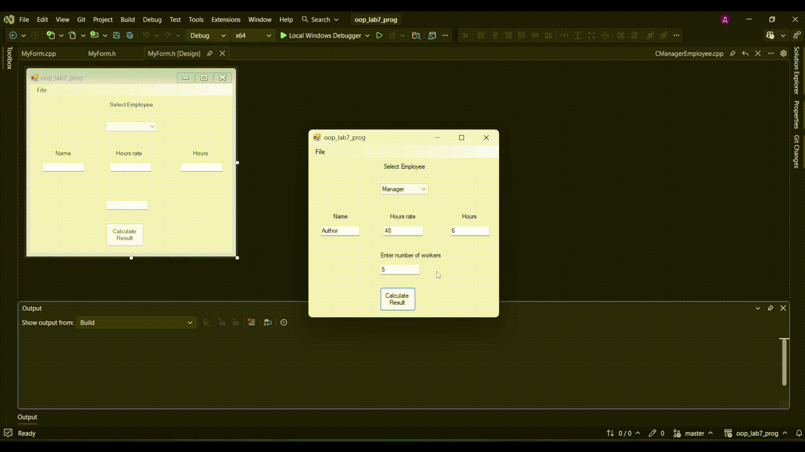

# 🧬 Class Inheritance with Windows Forms (C++/CLI)

<p align="center">
  
  
  
  
    
</p>

---

## 📖 Project Overview
This application is a practical demonstration of **Object-Oriented Programming (OOP)**, specifically focusing on **Class Inheritance**. Developed using C++/CLI and Windows Forms, it manages different types of employees within a corporate structure.

The project uses a base class `CEmployee` and several derived classes (`CManager`, `CIngineer`, `CSaleman`) to handle specific data and behaviors.

---

## 🕹️ Visual Guide & Usage

Follow these steps to interact with the application:

### 1️⃣ Step 1: Select Employee Type
Choose the specific category of employee you want to create. This action determines which specialized class will be instantiated in the background.

<p align="center">
  
</p>

**What to do:**
* Click on the comboBox buttons between **Manager**, **Engineer**, or **Salesman**.

---

### 2️⃣ Step 2: Enter Employee Data
Once the type is selected, provide the necessary information. The interface allows you to input both general data and specific attributes.

<p align="center">
  
</p>

**What to do:**
* Fill in the text fields with the employee's name, hours rate you want to work and press button to see the results.

---

### 3️⃣ Step 3: Save and Display Data
Process the input to create the object and see the result of the inheritance logic in action.

<p align="center">
  
</p>

**What to do:**
* Click the **Save** button to trigger the class constructor and display the formatted output in the list or text area.

---

## 🛠️ Tech Stack
* **Language:** C++/CLI
* **Framework:** .NET Core / Windows Forms
* **IDE:** Visual Studio 2022

## 📂 Key Project Files
* `CEmployee.h / .cpp` — **Base Class** containing shared attributes.
* `CManagerEmployee.h`, `CIngineerEmployee.h`, `CSalemanEmployee.h` — **Derived Classes** demonstrating inheritance.
* `MyForm.h` — The main **GUI** implementation and event handling.

---

## 🚀 How to Run
1. Clone the repository:
   ```bash
   git clone [https://github.com/XkrasherX/Class-inheritance-with-Windows-Forms.git](https://github.com/XkrasherX/Class-inheritance-with-Windows-Forms.git)

---

## 👤 Author
**XkrasherX**
<p>
  <a href="https://github.com/XkrasherX">
    
  </a>
</p>

---

<p align="center">
  ✨ <i>If you found this project helpful for learning OOP, feel free to give it a star!</i> ✨
</p>
